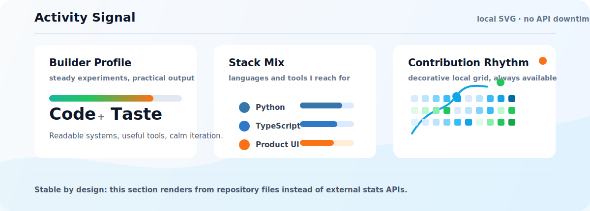

  

  
  
  

## About Me

I like turning unfinished thoughts into things that run.

Code is the instrument. Taste, patience, and clear thinking are the multiplier.

<table>
  <tr>
    <td width="50%">
      <h3>What I care about</h3>
      

        Durable products, clean interfaces, automation that removes repeated work,
        and systems that stay understandable after the first version ships.
      

    </td>
    <td width="50%">
      <h3>How I work</h3>
      

        Small experiments, fast feedback, careful refactoring, and honest notes
        about tradeoffs. Good engineering is visible in the details.
      

    </td>
  </tr>
</table>

## My Stack

  
  
  
  
  
  
  
  

## Activity

  

## Current Signal

<table>
  <tr>
    <td width="33%">
      <strong>Explore</strong> 
      AI tools, product systems, and better developer workflows.
    </td>
    <td width="33%">
      <strong>Build</strong> 
      Practical apps with clear user value and strong defaults.
    </td>
    <td width="33%">
      <strong>Refine</strong> 
      Interfaces, docs, tests, and the small details that make software feel solid.
    </td>
  </tr>
</table>

---

  Think clearly. Build steadily. Leave the codebase easier to understand.

